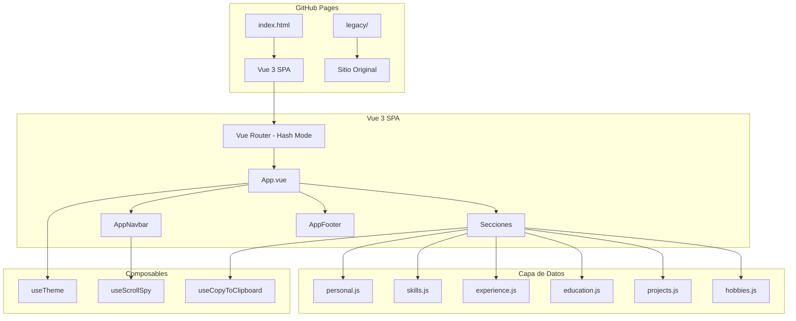
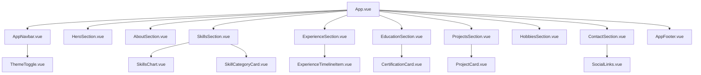

# Diseño: Modernización del Portfolio con Vue.js

## Visión General

Este documento describe el diseño técnico para migrar el portfolio personal de Alvaro Garcia desde un sitio estático basado en Bootstrap 4 + jQuery hacia una Single Page Application (SPA) moderna construida con Vue 3, Tailwind CSS y Vite.

El sitio actual se preservará en una carpeta `legacy/` y el nuevo sitio Vue.js se desplegará como sitio principal en GitHub Pages.

### Decisiones Técnicas Clave

| Decisión | Elección | Justificación |
|----------|----------|---------------|
| Framework UI | Vue 3 + Composition API | Reactividad, composables, `<script setup>` |
| Build Tool | Vite | HMR rápido, build optimizado, soporte nativo Vue |
| CSS Framework | Tailwind CSS v3 | Utilidades, dark mode con clase `dark`, purge automático |
| Librería de Componentes | Naive UI | HeroUI no tiene bindings Vue oficiales. Naive UI es la mejor alternativa: soporte nativo Vue 3, tree-shakeable, tema oscuro/claro integrado, componentes ricos (cards, timeline, collapse, tooltips) |
| Visualización | D3.js v7 | Gráficos interactivos de skills, integración manual con Vue reactivity |
| Íconos Tech | Devicons v2 | Íconos SVG de tecnologías, carga via CDN o npm |
| Animaciones | AOS (Animate On Scroll) | Ligero (~6KB), fácil integración, soporte `prefers-reduced-motion` nativo, suficiente para animaciones de scroll |
| Router | Vue Router (hash mode) | Compatibilidad SPA en GitHub Pages sin necesidad de 404.html redirect |
| Deploy | GitHub Pages | Output directo a `docs/` o configuración de base path en Vite |

### ¿Por qué Naive UI sobre HeroUI?

HeroUI (anteriormente NextUI) solo ofrece bindings oficiales para React. No existe un port oficial para Vue. Las alternativas evaluadas fueron:

- **PrimeVue**: Completo pero pesado, estilo propio difícil de personalizar con Tailwind
- **Headless UI**: Muy minimalista, requiere construir todos los estilos desde cero
- **Naive UI**: Soporte nativo Vue 3, tree-shakeable, tema configurable que se integra bien con Tailwind, componentes como `NTimeline`, `NCollapse`, `NCard`, `NTooltip` que cubren exactamente las necesidades del portfolio

### ¿Por qué AOS sobre GSAP/Motion One?

- **GSAP**: Potente pero excesivo para animaciones de scroll simples. Licencia comercial para algunas features.
- **Motion One**: Buena API pero ecosistema más pequeño, menos documentación.
- **AOS**: Diseñado específicamente para animaciones al scroll, declarativo via atributos `data-aos`, respeta `prefers-reduced-motion`, ~6KB gzipped. Perfecto para el caso de uso.

---

## Arquitectura

### Diagrama de Arquitectura General



### Diagrama de Componentes



### Estructura de Directorios

```
portfolio/
├── legacy/                    # Sitio original migrado aquí
│   ├── index.html
│   ├── style.css
│   ├── css/
│   ├── js/
│   ├── imgs/
│   └── images/
├── src/
│   ├── App.vue                # Componente raíz
│   ├── main.js                # Entry point (monta app, AOS init, router)
│   ├── router.js              # Vue Router config (hash mode)
│   ├── components/
│   │   ├── layout/
│   │   │   ├── AppNavbar.vue
│   │   │   └── AppFooter.vue
│   │   ├── sections/
│   │   │   ├── HeroSection.vue
│   │   │   ├── AboutSection.vue
│   │   │   ├── SkillsSection.vue
│   │   │   ├── ExperienceSection.vue
│   │   │   ├── EducationSection.vue
│   │   │   ├── ProjectsSection.vue
│   │   │   ├── HobbiesSection.vue
│   │   │   └── ContactSection.vue
│   │   └── ui/
│   │       ├── SectionWrapper.vue
│   │       ├── SkillsChart.vue
│   │       ├── SkillCategoryCard.vue
│   │       ├── ExperienceTimelineItem.vue
│   │       ├── CertificationCard.vue
│   │       ├── ProjectCard.vue
│   │       ├── SocialLinks.vue
│   │       └── ThemeToggle.vue
│   ├── composables/
│   │   ├── useTheme.js
│   │   ├── useScrollSpy.js
│   │   └── useCopyToClipboard.js
│   ├── data/
│   │   ├── personal.js
│   │   ├── skills.js
│   │   ├── experience.js
│   │   ├── education.js
│   │   ├── projects.js
│   │   └── hobbies.js
│   └── assets/
│       └── imgs/              # Imágenes migradas
├── public/
│   └── favicon.ico
├── index.html                 # Entry HTML de Vite
├── vite.config.js
├── tailwind.config.js
├── postcss.config.js
├── package.json
└── README.md
```

---

## Componentes e Interfaces

### Componentes de Layout

#### AppNavbar.vue

```vue
<script setup>
// Props: ninguna
// Usa: useScrollSpy, useTheme
// Emite: ningún evento

import { useScrollSpy } from '@/composables/useScrollSpy'
import { useTheme } from '@/composables/useTheme'
import ThemeToggle from '@/components/ui/ThemeToggle.vue'

const sections = ['hero', 'about', 'skills', 'experience', 'education', 'projects', 'hobbies', 'contact']
const { activeSection } = useScrollSpy(sections)
const { isDark, toggleTheme } = useTheme()

const navItems = [
  { id: 'about', label: 'Sobre Mí' },
  { id: 'skills', label: 'Skills' },
  { id: 'experience', label: 'Experiencia' },
  { id: 'education', label: 'Educación' },
  { id: 'projects', label: 'Proyectos' },
  { id: 'hobbies', label: 'Hobbies' },
  { id: 'contact', label: 'Contacto' },
]

function scrollToSection(sectionId) {
  document.getElementById(sectionId)?.scrollIntoView({ behavior: 'smooth' })
}
</script>
```

- Barra fija (`fixed top-0`) con Tailwind
- Menú hamburguesa en móvil usando estado reactivo `isMenuOpen`
- Scroll spy resalta la sección activa comparando `activeSection` con cada `navItem.id`
- Incluye enlaces a redes sociales y `ThemeToggle`
- Al hacer clic en un item del menú hamburguesa, se cierra el menú (`isMenuOpen = false`)

#### SectionWrapper.vue

```vue
<script setup>
// Props
defineProps({
  id: String,        // ID de la sección para scroll spy
  title: String,     // Título de la sección (opcional)
  aos: {             // Tipo de animación AOS
    type: String,
    default: 'fade-up'
  }
})
</script>
```

Componente wrapper que envuelve cada sección con:
- `id` para anclas de navegación
- Atributo `data-aos` para animaciones de entrada
- Padding y max-width consistentes
- Título `<h2>` opcional con estilo uniforme

### Componentes de Sección

#### HeroSection.vue
- Importa datos de `@/data/personal.js`
- Muestra foto de perfil (imagen circular con Tailwind `rounded-full`), nombre, título, ubicación
- Botón de copiar email usando `useCopyToClipboard`
- Layout centrado, responsivo con `flex-col` en móvil

#### SkillsSection.vue + SkillsChart.vue

```vue
<!-- SkillsChart.vue -->
<script setup>
import { ref, onMounted, watch } from 'vue'
import * as d3 from 'd3'
import { useTheme } from '@/composables/useTheme'

const props = defineProps({
  skills: Array  // [{ name, level, icon, category }]
})

const chartRef = ref(null)
const { isDark } = useTheme()

onMounted(() => renderChart())
watch(isDark, () => renderChart())  // Re-render al cambiar tema

function renderChart() {
  // D3.js renderiza dentro del ref del DOM
  // Se limpia el SVG anterior antes de re-renderizar
  const svg = d3.select(chartRef.value)
  svg.selectAll('*').remove()
  // ... lógica D3 para bubble chart o bar chart interactivo
}
</script>
```

**Integración D3.js con Vue:**
- D3 opera sobre un `ref` del DOM (`chartRef`), no compite con el virtual DOM de Vue
- Vue controla cuándo renderizar (via `onMounted` y `watch`)
- D3 controla qué renderizar dentro del elemento SVG
- Al cambiar tema, se re-renderiza el chart con colores actualizados
- Tooltips nativos de D3 para hover en cada skill

#### ExperienceSection.vue + ExperienceTimelineItem.vue

- Timeline vertical usando Naive UI `NTimeline` o implementación custom con Tailwind
- Cada item es expandible/colapsable con `NCollapse` o estado reactivo `isExpanded`
- Datos cargados desde `@/data/experience.js`, ordenados por fecha descendente
- Animación de expand/collapse con `transition` de Vue

#### EducationSection.vue + CertificationCard.vue

- Tarjetas con Naive UI `NCard` o divs estilizados con Tailwind
- Badge de Credly como enlace externo (`target="_blank" rel="noopener"`)
- Muestra: nombre, institución, fecha, credential ID, enlace Credly

#### ProjectsSection.vue + ProjectCard.vue

- Grid responsivo (`grid-cols-1 md:grid-cols-2 lg:grid-cols-3`)
- Cada tarjeta: imagen circular, título, descripción, tecnologías (devicons), enlace
- Hover effect con scale transform
- Soporta tipos: proyecto personal, charla, evento comunitario

#### ContactSection.vue + SocialLinks.vue

- Email y teléfono con botón copiar (`useCopyToClipboard`)
- Feedback visual: toast o tooltip temporal "¡Copiado!"
- Grid de redes sociales con íconos Font Awesome
- Links: GitHub, LinkedIn, Instagram, WhatsApp, SlideShare

### Componentes UI Compartidos

#### ThemeToggle.vue

```vue
<script setup>
import { useTheme } from '@/composables/useTheme'
const { isDark, toggleTheme } = useTheme()
</script>
```

- Ícono sol/luna que alterna entre temas
- Transición suave del ícono con `transition`

### Composables

#### useTheme.js

```js
import { ref, watchEffect } from 'vue'

const isDark = ref(false)

export function useTheme() {
  // Inicialización: lee localStorage, fallback a prefers-color-scheme
  function init() {
    const stored = localStorage.getItem('theme')
    if (stored) {
      isDark.value = stored === 'dark'
    } else {
      isDark.value = window.matchMedia('(prefers-color-scheme: dark)').matches
    }
  }

  // Sincroniza clase 'dark' en <html> y persiste en localStorage
  watchEffect(() => {
    document.documentElement.classList.toggle('dark', isDark.value)
    localStorage.setItem('theme', isDark.value ? 'dark' : 'light')
  })

  function toggleTheme() {
    isDark.value = !isDark.value
  }

  return { isDark, toggleTheme, init }
}
```

#### useScrollSpy.js

```js
import { ref, onMounted, onUnmounted } from 'vue'

export function useScrollSpy(sectionIds) {
  const activeSection = ref(sectionIds[0])

  let observer = null

  onMounted(() => {
    observer = new IntersectionObserver(
      (entries) => {
        entries.forEach((entry) => {
          if (entry.isIntersecting) {
            activeSection.value = entry.target.id
          }
        })
      },
      { rootMargin: '-20% 0px -70% 0px' }
    )

    sectionIds.forEach((id) => {
      const el = document.getElementById(id)
      if (el) observer.observe(el)
    })
  })

  onUnmounted(() => observer?.disconnect())

  return { activeSection }
}
```

Usa `IntersectionObserver` en lugar del scroll listener manual del sitio actual. Más eficiente y preciso.

#### useCopyToClipboard.js

```js
import { ref } from 'vue'

export function useCopyToClipboard() {
  const copied = ref(false)

  async function copy(text) {
    try {
      await navigator.clipboard.writeText(text)
      copied.value = true
      setTimeout(() => { copied.value = false }, 2000)
    } catch {
      // Fallback para navegadores sin Clipboard API
      const textarea = document.createElement('textarea')
      textarea.value = text
      document.body.appendChild(textarea)
      textarea.select()
      document.execCommand('copy')
      document.body.removeChild(textarea)
      copied.value = true
      setTimeout(() => { copied.value = false }, 2000)
    }
  }

  return { copied, copy }
}
```

---

## Modelos de Datos

### personal.js

```js
export default {
  fullName: 'Alvaro Garcia',
  title: 'Software Engineer & Big Data Engineer',
  subtitle: 'Data Specialist IA | Big Data | InfoSec',
  degree: "Bachelor's Degree in Computer Science",
  degreeInstitution: 'ORT',
  degreeLink: 'https://www.ort.edu.ar',
  location: 'Buenos Aires, Argentina',
  email: '[email]',
  phone: '[phone_number]',
  profileImage: '/imgs/profile.JPG',
  cvLink: '/Alvaro_Nicolas_Garcia_Guillen_CV_2025_EN.pdf',
  socialLinks: [
    { name: 'GitHub', url: 'https://github.com/alvarongg', icon: 'fab fa-github' },
    { name: 'LinkedIn', url: 'https://www.linkedin.com/in/alvaro-nicolas-garcia-guillen-66531750', icon: 'fab fa-linkedin' },
    { name: 'Instagram', url: 'https://www.instagram.com/alvarongg', icon: 'fab fa-instagram' },
    { name: 'WhatsApp', url: 'https://api.whatsapp.com/send?phone=[phone_number]', icon: 'fab fa-whatsapp' },
    { name: 'SlideShare', url: 'https://es.slideshare.net/AlvaroGarcia86045', icon: 'fa fa-slideshare' },
  ],
  aboutMe: [
    'Hi! I\'m Alvaro, a specialist in solving business problems focused on data...',
    'I have a diverse skill set that includes architecture design, pre-sales...',
  ]
}
```

### skills.js

```js
export default {
  technical: [
    {
      name: 'Big Data AWS',
      icon: 'devicon-amazonwebservices-original',
      details: ['Lambda', 'S3', 'Glue', 'DynamoDB', 'SQS', 'SNS', 'Athena', 'QuickSight', 'Kinesis'],
      level: 90  // Para visualización D3
    },
    {
      name: 'Infrastructure as Code',
      icon: 'devicon-terraform-plain',
      details: ['Serverless Framework', 'CDK', 'SAM', 'CloudFormation', 'Terraform'],
      level: 85
    },
    {
      name: 'Python',
      icon: 'devicon-python-plain',
      details: ['Pandas', 'SK-Learn', 'PySpark', 'Django', 'Flask', 'FastAPI'],
      level: 88
    },
    // ... más skills
  ],
  soft: [
    { name: 'Problem Solving', icon: 'fas fa-puzzle-piece' },
    { name: 'Team Builder', icon: 'fas fa-users' },
    { name: 'Communication and Leadership', icon: 'fas fa-comments' },
    { name: 'Creative Thinking', icon: 'fas fa-lightbulb' },
    { name: 'Self-taught', icon: 'fas fa-book-reader' },
    { name: 'Interdisciplinary', icon: 'fas fa-project-diagram' },
  ],
  languages: [
    { name: 'Spanish', level: 'Native' },
    { name: 'English', level: 'Upper-Intermediate (B2)' },
  ]
}
```

### experience.js

```js
export default [
  {
    id: 'cloudhesive',
    title: 'Lead Data Engineer',
    company: 'Cloudhesive',
    period: 'OCT 2021 / PRESENT',
    startDate: '2021-10',
    icon: 'fas fa-users',
    description: 'Leading a team of engineers...',
    responsibilities: [
      'Lead a team of data engineers',
      'Speaker at conferences and events',
      // ...
    ]
  },
  // ... más posiciones, ordenadas por startDate desc
]
```

### education.js

```js
export default {
  degrees: [
    {
      title: "Bachelor's Degree in Computer Science",
      institution: 'ORT',
      institutionUrl: 'https://www.ort.edu.ar',
      year: 2016,
      average: '8.89',
      location: 'Buenos Aires, Argentina'
    }
  ],
  certifications: [
    {
      title: 'AWS Cloud Practitioner',
      issuer: 'AWS',
      date: 'Nov 2021',
      credlyUrl: 'https://www.credly.com/badges/356d892c-bf52-4295-8211-7c3c87a0d45a',
      credentialId: null
    },
    {
      title: 'SAP BusinessObjects 4.0 BI and EIM',
      issuer: 'SAP',
      date: 'May 2013',
      credlyUrl: null,
      credentialId: 'S0009786200ID'
    },
    // ... más certificaciones
  ],
  courses: [
    {
      title: 'Data Science Bootcamp',
      institution: 'Plataforma 5',
      institutionUrl: 'https://www.plataforma5.la/',
      description: 'Intensive 11-day course...',
      location: 'Buenos Aires, Argentina'
    }
  ]
}
```

### projects.js

```js
export default [
  {
    id: 'recap-2023-p2',
    title: 'Host at AWS User Group Chile: Re:Cap of Re:Invent 2023 Part 2',
    description: 'Pioneered as the first in LATAM to host an online event...',
    image: '/imgs/projects/recap_2023.jpeg',
    type: 'event',  // 'project' | 'talk' | 'event'
    technologies: ['aws'],
    links: [
      { label: 'Youtube Video', url: 'https://www.youtube.com/watch?v=6x8IAFw7yn8', icon: 'fab fa-youtube' }
    ]
  },
  // ... más proyectos
]
```

### hobbies.js

```js
export default [
  { name: 'Radioafición', icon: 'fas fa-broadcast-tower', description: 'QSL, Meshtastic...' },
  { name: 'Comunidades AWS', icon: 'fab fa-aws', description: 'AWS User Groups...' },
  // ... más hobbies
]
```

---

## Build y Despliegue

### Configuración de Vite

```js
// vite.config.js
import { defineConfig } from 'vite'
import vue from '@vitejs/plugin-vue'
import { resolve } from 'path'

export default defineConfig({
  plugins: [vue()],
  base: '/',  // Ajustar si el repo no es username.github.io
  resolve: {
    alias: {
      '@': resolve(__dirname, 'src')
    }
  },
  build: {
    outDir: 'docs',  // GitHub Pages sirve desde /docs
    emptyOutDir: false,  // No borrar legacy/ si está dentro
  }
})
```

### Configuración de Tailwind

```js
// tailwind.config.js
export default {
  content: ['./index.html', './src/**/*.{vue,js}'],
  darkMode: 'class',  // Tema oscuro controlado por clase 'dark' en <html>
  theme: {
    extend: {
      // Colores personalizados del portfolio
    }
  },
  plugins: []
}
```

### Vue Router (Hash Mode)

```js
// src/router.js
import { createRouter, createWebHashHistory } from 'vue-router'
import App from './App.vue'

const router = createRouter({
  history: createWebHashHistory(),
  routes: [
    { path: '/', component: App }
  ],
  scrollBehavior(to) {
    if (to.hash) {
      return { el: to.hash, behavior: 'smooth' }
    }
  }
})

export default router
```

**Nota sobre SPA en GitHub Pages:** Se usa hash mode (`/#/`) en lugar de history mode para evitar el problema de 404 al recargar rutas. Esto elimina la necesidad de un archivo `404.html` con redirect hack.

### Inicialización de AOS

```js
// src/main.js
import { createApp } from 'vue'
import App from './App.vue'
import router from './router'
import AOS from 'aos'
import 'aos/dist/aos.css'
import './style.css'  // Tailwind imports

const app = createApp(App)
app.use(router)
app.mount('#app')

AOS.init({
  duration: 800,
  once: true,  // Animar solo la primera vez
  disable: () => window.matchMedia('(prefers-reduced-motion: reduce)').matches
})
```

### Estrategia de Despliegue

1. `npm run build` genera output en `docs/`
2. La carpeta `legacy/` se mantiene en la raíz del repo (fuera de `src/`)
3. GitHub Pages se configura para servir desde la rama `main`, carpeta `docs/`
4. Alternativamente, se puede usar GitHub Actions para build automático

---

## Propiedades de Correctitud

*Una propiedad es una característica o comportamiento que debe mantenerse verdadero en todas las ejecuciones válidas de un sistema — esencialmente, una declaración formal sobre lo que el sistema debe hacer. Las propiedades sirven como puente entre especificaciones legibles por humanos y garantías de correctitud verificables por máquinas.*

### Propiedad 1: Validación de esquema de datos

*Para cualquier* módulo de datos exportado (personal, skills, experience, education, projects, hobbies), el objeto exportado debe conformar su esquema esperado: skills debe tener las categorías `technical`, `soft` y `languages`; experience debe ser un array de objetos con `title`, `company`, `period`, `startDate`; education debe tener `degrees`, `certifications` y `courses`; projects debe ser un array con `title`, `description`, `type`, `links`; hobbies debe ser un array con `name`, `icon`, `description`.

**Valida: Requisitos 2.1, 5.4**

### Propiedad 2: Cantidad de elementos renderizados coincide con datos

*Para cualquier* array de datos (experiencias, certificaciones, proyectos, hobbies, redes sociales) de longitud N, el componente correspondiente debe renderizar exactamente N elementos hijos del tipo esperado (timeline items, cards, links, etc.).

**Valida: Requisitos 2.3, 6.1, 7.1, 10.3**

### Propiedad 3: Completitud de campos renderizados

*Para cualquier* item de datos con campos requeridos (nombre, título, descripción, etc.), el componente renderizado debe contener texto o elementos que representen cada campo requerido. Esto aplica a: hero (nombre, título, ubicación, email), about (texto descriptivo), experiencia (título, empresa, período), certificaciones (nombre, emisor, fecha), proyectos (título, descripción, enlaces), hobbies (nombre, ícono), contacto (email, teléfono).

**Valida: Requisitos 3.1, 4.1, 6.3, 7.3, 8.1, 9.1, 10.1**

### Propiedad 4: Round-trip de copiar al portapapeles

*Para cualquier* string no vacío, al invocar la función `copy` del composable `useCopyToClipboard`, el portapapeles debe contener exactamente ese string, y el estado `copied` debe ser `true` inmediatamente después y volver a `false` tras el timeout.

**Valida: Requisitos 3.2, 10.2**

### Propiedad 5: D3 renderiza un elemento visual por skill

*Para cualquier* array de skills técnicos de longitud N, el componente `SkillsChart` debe producir un SVG que contenga exactamente N elementos visuales (círculos, barras o grupos) representando cada skill.

**Valida: Requisito 5.1**

### Propiedad 6: Íconos devicon presentes para items con tecnologías

*Para cualquier* item (skill o proyecto) que tenga un campo de ícono devicon definido, el elemento renderizado debe contener un elemento con la clase CSS del devicon correspondiente.

**Valida: Requisitos 5.2, 8.3**

### Propiedad 7: Experiencias ordenadas cronológicamente

*Para cualquier* lista de experiencias laborales con fechas, después de aplicar la función de ordenamiento, cada elemento debe tener una fecha de inicio mayor o igual que la del elemento siguiente (orden descendente).

**Valida: Requisito 6.4**

### Propiedad 8: Enlaces externos abren en nueva pestaña

*Para cualquier* item renderizado que contenga enlaces externos (certificaciones con Credly, proyectos con links, redes sociales), todos los elementos `<a>` con URLs externas deben tener el atributo `target="_blank"` y `rel="noopener"`.

**Valida: Requisitos 7.2, 8.2, 8.4**

### Propiedad 9: Scroll spy identifica sección activa correctamente

*Para cualquier* conjunto de secciones con IDs y un estado donde exactamente una sección está intersectando el viewport, el composable `useScrollSpy` debe reportar `activeSection` igual al ID de esa sección.

**Valida: Requisito 11.2**

### Propiedad 10: Menú hamburguesa se cierra al navegar

*Para cualquier* estado donde `isMenuOpen` es `true`, al ejecutar la acción de navegación a una sección, `isMenuOpen` debe cambiar a `false`.

**Valida: Requisito 11.5**

### Propiedad 11: Round-trip de tema (toggle y persistencia)

*Para cualquier* estado inicial del tema, al invocar `toggleTheme`, el valor de `isDark` debe invertirse, la clase `dark` en `document.documentElement` debe reflejar el nuevo estado, y `localStorage.getItem('theme')` debe retornar el valor correspondiente ('dark' o 'light'). Además, al inicializar sin valor en localStorage, el tema debe coincidir con `prefers-color-scheme` del sistema.

**Valida: Requisitos 12.1, 12.2, 12.3, 12.5**

---

## Manejo de Errores

### Errores de Carga de Datos

- Si un archivo de datos no se puede importar, el componente debe renderizar un estado vacío graceful (no crash)
- Los composables deben manejar excepciones internamente y retornar estados por defecto

### Errores de Clipboard API

- `useCopyToClipboard` implementa fallback con `document.execCommand('copy')` para navegadores sin soporte de Clipboard API
- Si ambos métodos fallan, `copied` permanece `false` (sin crash)

### Errores de D3.js

- Si el array de skills está vacío, `SkillsChart` renderiza un mensaje "Sin datos" en lugar de un SVG vacío
- Si el contenedor DOM no existe al momento de renderizar, se usa optional chaining para evitar errores

### Errores de IntersectionObserver

- `useScrollSpy` verifica que `IntersectionObserver` existe antes de usarlo (fallback: no scroll spy)
- Se desconecta el observer en `onUnmounted` para evitar memory leaks

### Errores de localStorage

- `useTheme` envuelve accesos a localStorage en try/catch (modo incógnito en algunos navegadores lanza excepciones)
- Fallback a `prefers-color-scheme` si localStorage no está disponible

---

## Estrategia de Testing

### Enfoque Dual: Tests Unitarios + Tests de Propiedades

Se utilizan dos tipos de tests complementarios:

1. **Tests unitarios**: Verifican ejemplos específicos, edge cases y condiciones de error
2. **Tests de propiedades (PBT)**: Verifican propiedades universales con inputs generados aleatoriamente

### Librería de Property-Based Testing

Se usará **fast-check** (`fc`) como librería de PBT para JavaScript/TypeScript. Es la librería PBT más madura del ecosistema JS, con soporte para:
- Generadores arbitrarios (strings, arrays, objetos, etc.)
- Shrinking automático de contraejemplos
- Integración nativa con Vitest

### Framework de Testing

- **Vitest** como test runner (integración nativa con Vite)
- **@vue/test-utils** para montar componentes Vue en tests
- **fast-check** para property-based testing
- **jsdom** como entorno DOM para tests

### Configuración de Tests de Propiedades

- Cada test de propiedad debe ejecutar mínimo **100 iteraciones**
- Cada test debe incluir un comentario referenciando la propiedad del diseño
- Formato del tag: **Feature: portfolio-vue-modernization, Property {número}: {texto de la propiedad}**
- Cada propiedad de correctitud debe ser implementada por un **único** test de propiedad

### Tests Unitarios

Los tests unitarios cubren:
- Ejemplos específicos de renderizado de componentes
- Edge cases: datos vacíos, campos nulos, arrays de un solo elemento
- Integración: AOS inicializado con `prefers-reduced-motion` check
- Configuración: router usa hash history, Vite output a `docs/`
- UI: menú hamburguesa toggle, expand/collapse de experiencia

### Tests de Propiedades (PBT)

Cada propiedad de correctitud (1-11) se implementa como un test PBT individual:

```js
// Ejemplo: Propiedad 7 - Experiencias ordenadas cronológicamente
// Feature: portfolio-vue-modernization, Property 7: Experiencias ordenadas cronológicamente
import { fc } from 'fast-check'

test('experiencias se ordenan por fecha descendente', () => {
  fc.assert(
    fc.property(
      fc.array(fc.record({
        title: fc.string(),
        company: fc.string(),
        startDate: fc.date().map(d => d.toISOString().slice(0, 7))
      }), { minLength: 2 }),
      (experiences) => {
        const sorted = sortExperiences(experiences)
        for (let i = 0; i < sorted.length - 1; i++) {
          expect(sorted[i].startDate >= sorted[i + 1].startDate).toBe(true)
        }
      }
    ),
    { numRuns: 100 }
  )
})
```

### Cobertura de Propiedades

| Propiedad | Tipo de Test | Composable/Componente |
|-----------|-------------|----------------------|
| P1: Validación de esquema | PBT | Módulos de datos |
| P2: Cantidad de elementos | PBT | Componentes de sección |
| P3: Completitud de campos | PBT | Componentes de sección |
| P4: Copy round-trip | PBT | useCopyToClipboard |
| P5: D3 elementos por skill | PBT | SkillsChart |
| P6: Devicons presentes | PBT | SkillCategoryCard, ProjectCard |
| P7: Orden cronológico | PBT | sortExperiences utility |
| P8: Enlaces target blank | PBT | CertificationCard, ProjectCard, SocialLinks |
| P9: Scroll spy | PBT | useScrollSpy |
| P10: Menú cierra al navegar | PBT | AppNavbar |
| P11: Tema round-trip | PBT | useTheme |
